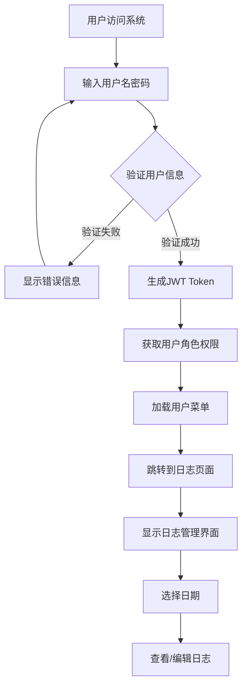
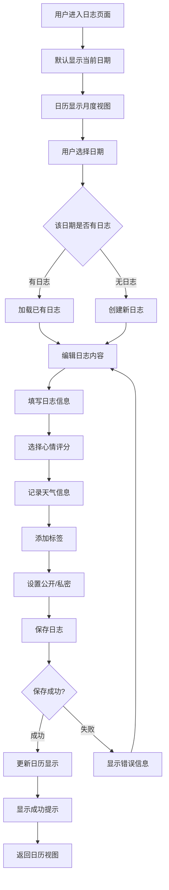
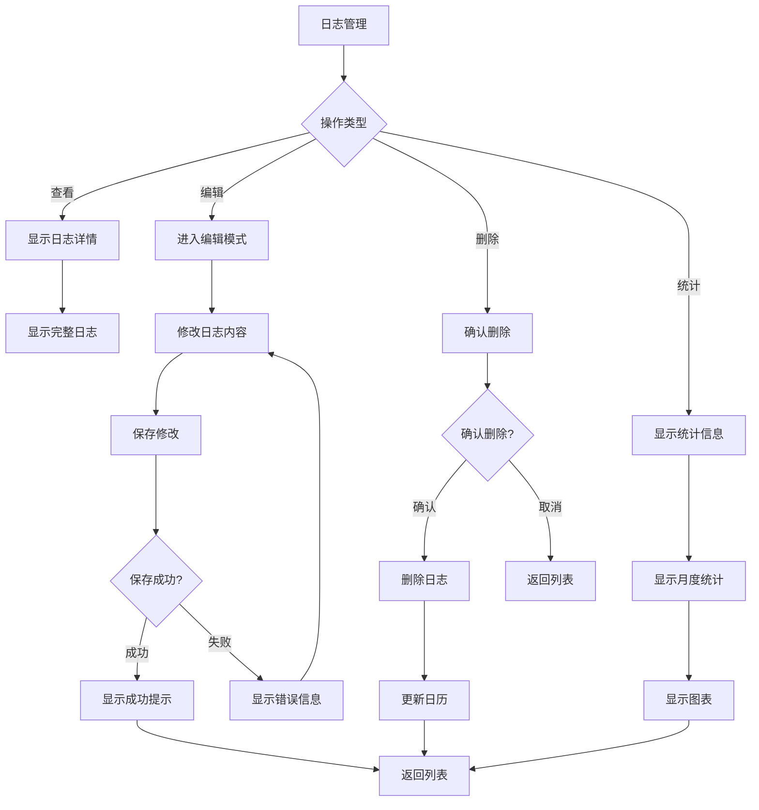
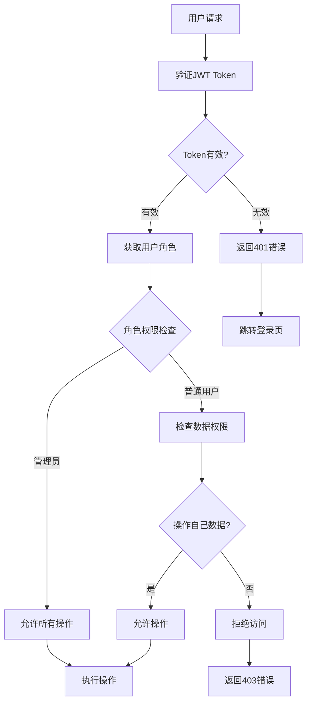

# XData 日志填写功能需求文档

## 📋 概述

本文档详细描述了XData系统的日志填写功能需求，包括用户可以通过日历选择日期进行日志填写，支持心情评分、天气记录、标签管理等功能。

## 🎯 功能目标

### 核心功能
- 用户可以选择日期进行日志填写
- 默认显示当前日期
- 使用日历组件进行日期选择
- 支持日志内容的富文本编辑
- 提供心情评分功能（0-5星）
- 记录天气信息
- 支持标签管理
- 提供公开/私密设置

### 用户体验目标
- 界面简洁直观，操作便捷
- 响应式设计，支持多设备访问
- 支持深色/浅色主题切换
- 提供数据统计和可视化
- 自动保存草稿功能

## 🏗️ 系统架构

### 技术栈
- **后端**: Go + Gin + GORM + MySQL
- **前端**: Vue 3 + TypeScript + Element Plus
- **状态管理**: Pinia
- **构建工具**: Vite

### 系统架构图
```
┌─────────────────┐    ┌─────────────────┐    ┌─────────────────┐
│   前端界面层     │    │    API网关层     │    │   业务逻辑层     │
│                 │    │                 │    │                 │
│  Vue 3 + TS     │◄──►│   Gin Router    │◄──►│  Service Layer  │
│  Element Plus   │    │   Middleware    │    │  Repository     │
│  Pinia Store    │    │   Auth/JWT      │    │  Model          │
└─────────────────┘    └─────────────────┘    └─────────────────┘
                                │                       │
                                ▼                       ▼
                       ┌─────────────────┐    ┌─────────────────┐
                       │   数据访问层     │    │   数据存储层     │
                       │                 │    │                 │
                       │  GORM ORM       │◄──►│  MySQL Database │
                       │  Query Builder  │    │  Redis Cache    │
                       └─────────────────┘    └─────────────────┘
```

## 📊 数据库设计

### 日志表 (sys_daily_log)
```sql
CREATE TABLE sys_daily_log (
    id BIGINT PRIMARY KEY AUTO_INCREMENT COMMENT '主键ID',
    user_id BIGINT NOT NULL COMMENT '用户ID',
    log_date DATE NOT NULL COMMENT '日志日期',
    content TEXT NOT NULL COMMENT '日志内容',
    mood TINYINT DEFAULT 0 COMMENT '心情评分: 0-5',
    weather VARCHAR(50) COMMENT '天气',
    tags VARCHAR(500) COMMENT '标签，逗号分隔',
    is_public BOOLEAN DEFAULT FALSE COMMENT '是否公开',
    created_at TIMESTAMP DEFAULT CURRENT_TIMESTAMP COMMENT '创建时间',
    updated_at TIMESTAMP DEFAULT CURRENT_TIMESTAMP ON UPDATE CURRENT_TIMESTAMP COMMENT '更新时间',
    
    UNIQUE KEY uk_user_date (user_id, log_date) COMMENT '用户日期唯一索引',
    INDEX idx_user_id (user_id) COMMENT '用户ID索引',
    INDEX idx_log_date (log_date) COMMENT '日期索引',
    INDEX idx_created_at (created_at) COMMENT '创建时间索引',
    
    FOREIGN KEY (user_id) REFERENCES sys_user(id) ON DELETE CASCADE
) ENGINE=InnoDB DEFAULT CHARSET=utf8mb4 COMMENT='用户日志表';
```

### 字段说明
| 字段名 | 类型 | 长度 | 允许空 | 默认值 | 说明 |
|--------|------|------|--------|--------|------|
| id | BIGINT | - | NO | AUTO_INCREMENT | 主键ID |
| user_id | BIGINT | - | NO | - | 用户ID，关联sys_user表 |
| log_date | DATE | - | NO | - | 日志日期 |
| content | TEXT | - | NO | - | 日志内容 |
| mood | TINYINT | - | YES | 0 | 心情评分(0-5) |
| weather | VARCHAR | 50 | YES | NULL | 天气信息 |
| tags | VARCHAR | 500 | YES | NULL | 标签，逗号分隔 |
| is_public | BOOLEAN | - | YES | FALSE | 是否公开 |
| created_at | TIMESTAMP | - | YES | CURRENT_TIMESTAMP | 创建时间 |
| updated_at | TIMESTAMP | - | YES | CURRENT_TIMESTAMP | 更新时间 |

## 🔄 业务流程图

### 1. 用户登录流程


### 2. 日志填写流程


### 3. 日志管理流程


### 4. 权限控制流程


## 🎨 界面设计

### 1. 主页面布局
```
┌─────────────────────────────────────────────────────────────┐
│                       顶部导航栏                              │
├─────────────────┬───────────────────────────────────────────┤
│                 │                                           │
│   左侧日历区域   │             右侧日志编辑器                  │
│                 │                                           │
│  ┌───────────┐  │  ┌─────────────────────────────────────┐  │
│  │   日历     │  │  │           日期选择器                │  │
│  │           │  │  └─────────────────────────────────────┘  │
│  │ 2024-01   │  │  ┌─────────────────────────────────────┐  │
│  │           │  │  │           心情选择器                │  │
│  │ 日 一 二  │  │  └─────────────────────────────────────┘  │
│  │ 1  2  3  │  │  ┌─────────────────────────────────────┐  │
│  │ 4  5  6  │  │  │           天气记录                  │  │
│  │ 7  8  9  │  │  └─────────────────────────────────────┘  │
│  │ ...       │  │  ┌─────────────────────────────────────┐  │
│  └───────────┘  │  │           标签管理                  │  │
│                 │  └─────────────────────────────────────┘  │
│                 │  ┌─────────────────────────────────────┐  │
│                 │  │           日志内容编辑器            │  │
│                 │  │                                     │  │
│                 │  │  [富文本编辑区域]                   │  │
│                 │  │                                     │  │
│                 │  └─────────────────────────────────────┘  │
│                 │  ┌─────────────────────────────────────┐  │
│                 │  │           操作按钮                  │  │
│                 │  │  [保存] [删除] [公开设置]          │  │
│                 │  └─────────────────────────────────────┘  │
└─────────────────┴───────────────────────────────────────────┘
```

### 2. 日历组件设计
- **月份导航**: 支持前后月份切换
- **日期标记**: 有日志的日期显示特殊标记
- **心情图标**: 根据心情评分显示对应图标
- **今日高亮**: 当前日期高亮显示
- **点击选择**: 点击日期切换到对应日志

### 3. 编辑器组件设计
- **日期选择器**: 支持快速切换日期
- **心情选择器**: 5星评分系统
- **天气输入**: 文本输入天气信息
- **标签管理**: 支持添加/删除标签
- **富文本编辑**: 支持格式化文本编辑
- **公开设置**: 复选框控制是否公开

## 🔧 技术实现

### 1. 后端API设计

#### 日志管理接口
```go
// 创建日志
POST /api/logs
{
    "logDate": "2024-01-15",
    "content": "今天的工作内容...",
    "mood": 4,
    "weather": "晴天",
    "tags": "工作,会议",
    "isPublic": false
}

// 获取日志详情
GET /api/logs/:id
Response: {
    "id": 1,
    "userId": 1,
    "logDate": "2024-01-15",
    "content": "今天的工作内容...",
    "mood": 4,
    "weather": "晴天",
    "tags": "工作,会议",
    "isPublic": false,
    "createTime": "2024-01-15 10:30:00",
    "updateTime": "2024-01-15 10:30:00"
}

// 更新日志
PUT /api/logs/:id
{
    "logDate": "2024-01-15",
    "content": "更新的内容...",
    "mood": 5,
    "weather": "多云",
    "tags": "工作,会议,更新",
    "isPublic": true
}

// 删除日志
DELETE /api/logs/:id

// 获取日志列表
GET /api/logs?page=1&size=10&keyword=工作
Response: {
    "list": [...],
    "total": 100,
    "page": 1,
    "size": 10
}

// 获取指定日期日志
GET /api/logs/date/2024-01-15

// 获取月度日志
GET /api/logs/monthly/2024/01

// 获取统计信息
GET /api/logs/stats/2024/01
Response: {
    "totalLogs": 31,
    "moodStats": [
        {"mood": 5, "count": 10},
        {"mood": 4, "count": 15},
        {"mood": 3, "count": 5},
        {"mood": 2, "count": 1},
        {"mood": 1, "count": 0},
        {"mood": 0, "count": 0}
    ],
    "tagStats": [
        {"tag": "工作", "count": 20},
        {"tag": "会议", "count": 15},
        {"tag": "学习", "count": 10}
    ],
    "weatherStats": [
        {"weather": "晴天", "count": 15},
        {"weather": "多云", "count": 10},
        {"weather": "雨天", "count": 6}
    ]
}
```

### 2. 前端组件设计

#### 主页面组件 (LogIndex.vue)
```vue
<template>
  <div class="page-container">
    <div class="content-area">
      <!-- 左侧日历 -->
      <div class="sidebar">
        <div class="toolbar">
          <h3>日志日历</h3>
          <el-button @click="goToToday" size="small">
            今天
          </el-button>
        </div>
        <div class="calendar-container">
          <LogCalendar 
            v-model:selected-date="selectedDate"
            :logs="monthlyLogs"
            @date-change="handleDateChange"
          />
        </div>
      </div>
      
      <!-- 右侧编辑器 -->
      <div class="content-main">
        <div class="editor-container">
          <LogEditor 
            v-model:log="currentLog"
            :loading="loading"
            @save="handleSave"
            @delete="handleDelete"
          />
        </div>
      </div>
    </div>
  </div>
</template>
```

#### 日历组件 (LogCalendar.vue)
```vue
<template>
  <div class="log-calendar">
    <el-calendar v-model="currentDate">
      <template #date-cell="{ data }">
        <div class="calendar-cell" @click="selectDate(data.day)">
          <span class="date-number">{{ getDayNumber(data.day) }}</span>
          <div class="log-indicator" v-if="hasLog(data.day)">
            <el-icon><Document /></el-icon>
          </div>
          <div class="mood-indicator" v-if="getMood(data.day)">
            <el-icon :class="getMoodClass(getMood(data.day))">
              <component :is="getMoodIcon(getMood(data.day))" />
            </el-icon>
          </div>
        </div>
      </template>
    </el-calendar>
  </div>
</template>
```

#### 编辑器组件 (LogEditor.vue)
```vue
<template>
  <div class="log-editor">
    <div class="editor-header">
      <div class="date-display">
        <el-date-picker
          v-model="log.logDate"
          type="date"
          placeholder="选择日期"
          format="YYYY-MM-DD"
          value-format="YYYY-MM-DD"
          @change="handleDateChange"
        />
      </div>
      <div class="editor-actions">
        <el-button @click="handleSave" :loading="saving" type="primary">
          保存
        </el-button>
        <el-button @click="handleDelete" type="danger" v-if="log.id">
          删除
        </el-button>
      </div>
    </div>
    
    <div class="editor-content">
      <el-form :model="log" label-width="80px">
        <el-form-item label="心情">
          <MoodSelector v-model="log.mood" />
        </el-form-item>
        
        <el-form-item label="天气">
          <el-input v-model="log.weather" placeholder="今天天气如何？" />
        </el-form-item>
        
        <el-form-item label="标签">
          <el-input v-model="log.tags" placeholder="添加标签，用逗号分隔" />
        </el-form-item>
        
        <el-form-item label="内容">
          <el-input
            v-model="log.content"
            type="textarea"
            :rows="15"
            placeholder="写下今天的故事..."
          />
        </el-form-item>
        
        <el-form-item>
          <el-checkbox v-model="log.isPublic">
            公开分享
          </el-checkbox>
        </el-form-item>
      </el-form>
    </div>
  </div>
</template>
```

## 🔐 权限设计

### 1. 菜单权限
在系统初始化时为普通用户角色分配日志管理菜单：

```go
// 在 init_data.go 中添加日志管理菜单
{
    ID:          40,
    Title:       "日志管理",
    Icon:        "ep:document",
    Path:        "/log",
    Component:   "log/index",
    ParentID:    nil,
    Sort:        4,
    Level:       1,
    Type:        2,
    IsHidden:    false,
    IsKeepAlive: true,
    IsIframe:    false,
}
```

### 2. 数据权限
- **管理员**: 可以查看所有用户的日志
- **普通用户**: 只能查看和编辑自己的日志
- **数据隔离**: 通过用户ID进行数据过滤

### 3. 操作权限
- **创建**: 所有登录用户都可以创建日志
- **查看**: 用户只能查看自己的日志
- **编辑**: 用户只能编辑自己的日志
- **删除**: 用户只能删除自己的日志

## 📈 数据统计

### 1. 月度统计
- 日志总数统计
- 心情分布统计
- 标签使用频率
- 天气记录统计
- 连续记录天数

### 2. 可视化图表
- 心情趋势折线图
- 标签云图
- 天气分布饼图
- 月度日志数量柱状图

## 🚀 实施计划

### 阶段一：基础架构（1天）
- [ ] 创建数据库表结构
- [ ] 实现后端基础模型
- [ ] 创建前端页面框架
- [ ] 配置路由和菜单

### 阶段二：核心功能（2天）
- [ ] 实现日志CRUD接口
- [ ] 开发日历组件
- [ ] 开发日志编辑器
- [ ] 实现日期选择功能

### 阶段三：用户体验（1天）
- [ ] 添加心情选择器
- [ ] 实现标签管理
- [ ] 添加天气记录
- [ ] 优化界面交互

### 阶段四：统计功能（1天）
- [ ] 实现统计接口
- [ ] 开发统计图表
- [ ] 添加数据可视化
- [ ] 完善错误处理

### 阶段五：测试优化（1天）
- [ ] 功能测试
- [ ] 性能优化
- [ ] 用户体验优化
- [ ] 文档完善

## 📋 验收标准

### 功能验收
- [ ] 用户可以成功创建、编辑、删除日志
- [ ] 日历正确显示日志标记和心情图标
- [ ] 日期选择功能正常工作
- [ ] 心情评分和天气记录功能正常
- [ ] 标签管理功能正常
- [ ] 公开/私密设置功能正常

### 性能验收
- [ ] 页面加载时间 < 2秒
- [ ] 日志保存响应时间 < 1秒
- [ ] 日历切换响应时间 < 500ms
- [ ] 支持1000+日志数据

### 用户体验验收
- [ ] 界面美观，符合设计规范
- [ ] 操作流畅，无卡顿
- [ ] 错误提示清晰明确
- [ ] 支持响应式布局
- [ ] 深色主题支持正常

## 🔗 相关文档

- [XData 系统样式布局标准化文档](./style-guide.md)
- [Element Plus 官方文档](https://element-plus.org/)
- [Vue 3 官方文档](https://vuejs.org/)

---

*文档版本: 1.0.0*  
*最后更新: 2024年1月15日*  
*作者: XData 开发团队* 